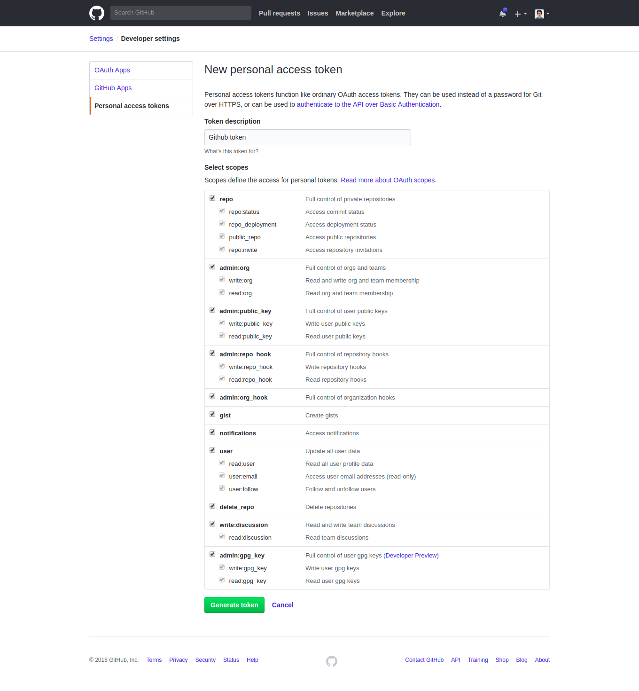

# ghub-pms
[](https://opensource.org/licenses/MIT)


Open Source Project to track the github repository and categorize locally.

### Feature

- Categorize repo model with respect to category
- Automatically generate repo model while creating superuser
- PyGithub package is used for interactions with the GitHub API v3 

### Simple Demo

- create github token in settings >  Developer settings > Personal access tokens




- create superuser with command
```bash
$ python manage.py createsuperuser
```

```
Full name: admin
Email address: admin@admin.com
Git token: XXX
Password: 
Password (again):  
contains token
Populating repo ...
```

- Add github token while creating superuser
- Automatically get user repo information and create repo model instance
- Now, we could view repo model in django admin panel
- Enjoy!

### Reference

- [http://pygithub.readthedocs.io/](http://pygithub.readthedocs.io/)